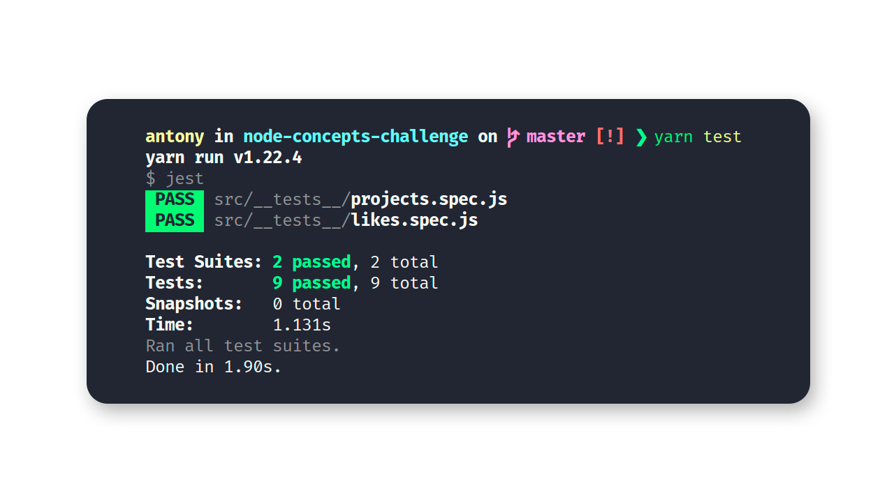

<h3 align="center">
  Desafio GoStack: Conceitos do Node.js :trophy:
</h3>

  

  

  <a href="#rocket-sobre-o-desafio">Sobre o desafio</a>&nbsp;&nbsp;&nbsp;|&nbsp;&nbsp;&nbsp;
  <a href="#calendar-resultados">Resultados</a>&nbsp;&nbsp;&nbsp;|&nbsp;&nbsp;&nbsp;
  <a href="#como-executar">Como executar?</a>&nbsp;&nbsp;&nbsp;|&nbsp;&nbsp;&nbsp;
  <a href="#memo-licença">Licença</a>

## :rocket: Sobre o desafio

Nesse desafio, foi criada uma aplicação para treinar o que foi aprendido até agora no Node.js!

Essa é uma aplicação para armazenar repositórios do seu portfólio, que irá permitir a criação, listagem, atualização e remoção dos repositórios, e além disso permitir que os repositórios possam receber "likes".

### Rotas da aplicação

As rotas a seguir representam as funcionalidades da aplicação desenvolvida.

- **`POST /repositories`**: Recebe `title`, `url` e `techs` dentro do corpo da requisição, sendo a URL o link para o github desse repositório (ou um link qualquer) e cria um repositório no sistema.

- **`GET /repositories`**: Lista todos os repositórios;

- **`PUT /repositories/:id`**: Altera apenas os campos: `título`, `url` e `techs` do repositório que possua o `id` igual ao `id` presente nos parâmetros da rota;

- **`DELETE /repositories/:id`**: Deleta o repositório com o `id` presente nos parâmetros da rota;

- **`POST /repositories/:id/like`**: Incrementa o número de likes do repositório específico escolhido através do `id` presente nos parâmetros da rota - a cada chamada dessa rota, o número de likes aumenta em 1;

### Específicação dos testes

Em cada teste há uma breve descrição dos requisitos que a aplicação precisou cumprir para que o teste passasse.

Para esse desafio temos os seguintes testes:

- **`should be able to create a new repository`**: Para que esse teste passe, a aplicação deve permitir que um repositório seja criado, e retorne um json com o projeto criado.

- **`should be able to list the repositories`**: Para que esse teste passe, a aplicação deve permitir que seja retornado um array com todos os repositórios que foram criados até o momento.

- **`should be able to update repository`**: Para que esse teste passe, a aplicação deve permitir que sejam alterados apenas os campos `url`, `title` e `techs`.

- **`should not be able to update a repository that does not exist`**: Para que esse teste passe, deve-se validar na rota de update se o id do repositório enviado pela url existe ou não. Caso não exista, um erro com status `400` deverá ser retornado.

- **`should not be able to update repository likes manually`**: Para que esse teste passe, não se deve permitir que a rota de update altere diretamente os likes desse repositório, mantendo o mesmo número de likes que o repositório já possuia antes da atualização. Isso porque o único lugar que deve atualizar essa informação é a rota de responsável por aumentar o número de likes.

- **`should be able to delete the repository`**: Para que esse teste passe, deve-se permitir que a rota de delete exclua um projeto, e ao fazer a exclusão, ele retorne uma resposta vazia, com status `204`.

- **`should not be able to delete a repository that does not exist`**: Para que esse teste passe, deve-se validar na rota de delete se o id do repositório enviado pela url existe ou não. Caso não exista, retornar um erro com status `400`.

- **`should be able to give a like to the repository`**: Para que esse teste passe, a aplicação deve permitir que um repositório com o id informado possa receber likes. O valor de likes deve ser incrementado em 1 a cada requisição, e como resultado, retornar um json contendo o repositório com o número de likes atualizado.

- **`should not be able to like a repository that does not exist`**: Para que esse teste passe, deve-se validar na rota de like se o id do repositório enviado pela url existe ou não. Caso não exista, retornar um erro com status `400`.

## :chart_with_upwards_trend: Resultados

A aplicação contemplou todos os testes submetidos e mencionados acima.

## :computer: Como executar?

- Clone esse repositório: `git clone https://github.com/lemosantony/node-concepts-challenge.git`;
- Entre na pasta criada: `cd node-concepts-challenge`
- Instale as dependências: `yarn` ou `npm install`
- Execute a aplicação: `yarn dev` ou `npm dev`
  
### Executando os testes

`yarn test` ou `npm test`.

## :memo: Licença

Esse projeto está sob a licença MIT. Veja o arquivo [LICENSE](LICENSE.md) para mais detalhes.

---

Feito com 💜 by Antony Lemos :wave: [Entre na comunidade da Rocketseat!](https://discordapp.com/invite/gCRAFhc)